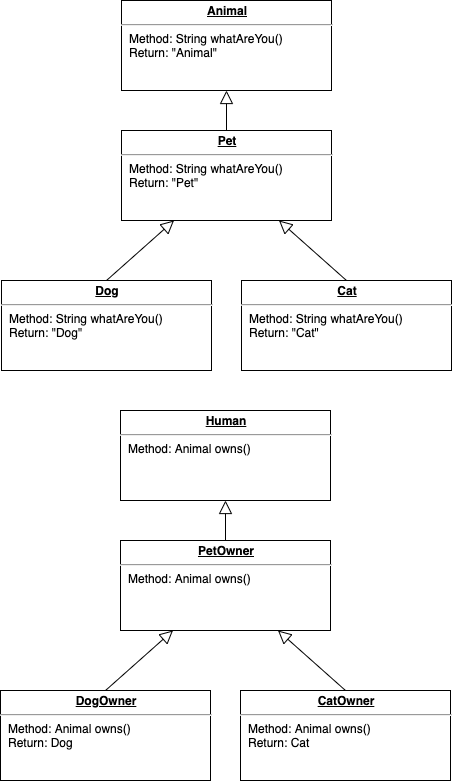

#### Covariance

Implement the below class hierarchy.
Make sure to implement the methods described in the diagram.
You do not need to use generics, the tests do not cater for generic implementations.

All you are required to do is extend/implement the required classes and implement the methods.
You do not need any constructors.
For methods which return an object (Cat or Dog), simply create and return a new object (Cat or Dog).

**Imports:** There are no imports included for this challenge.

