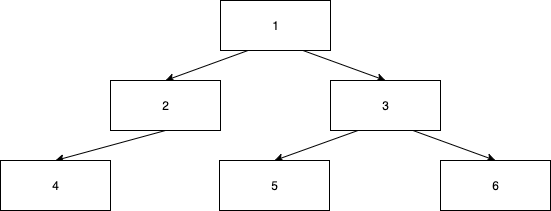

#### Flatten

You are required to take a `Tree` of integers and flatten in into an array.
The simplest way of doing this is through a depth-first traversal of the tree. 

**Imports:** There are no imports included for this challenge. 

##### Example

Input:  

Output:  
`[4, 2, 1, 5, 3, 6]`
